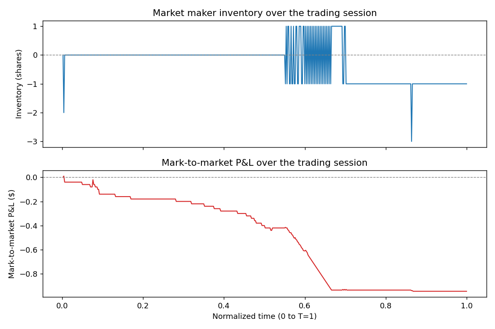
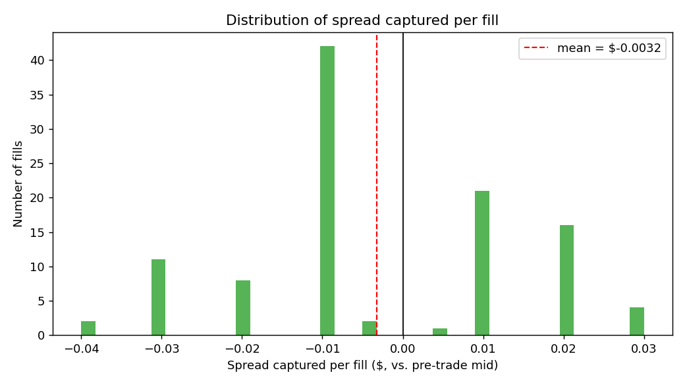

# Limit Order Book Simulator & Market-Making Strategy

A research-grade simulation of a limit order book (LOB) with a market-making
agent implementing the **Avellaneda-Stoikov (2008)** optimal market-making
model. Built from first principles in Python: a price-time priority matching
engine, stochastic order flow, an inventory-aware quoting strategy, and
performance analytics.

## Motivation

Market makers profit by continuously quoting both sides of the book and
capturing the bid-ask spread, but every fill shifts their inventory and
exposes them to directional price risk. The Avellaneda-Stoikov model gives a
closed-form way to manage this trade-off: it derives a *reservation price*
(a fair value skewed by current inventory) and an *optimal spread* around it,
so the market maker's quotes automatically lean against their own risk as
their position builds up.

This project implements that model on top of a real matching engine — rather
than a simplified analytical simulation — so the strategy has to survive
actual order flow, queue position, and partial fills, not just a toy price
process.

## Status

This is an active, in-progress build. Current state:

- [x] Core order book data structure (`orderbook.py`) — price levels, FIFO
      queues per level, best bid/ask, spread, mid-price
- [x] Matching engine (`matching_engine.py`) — crossing logic for limit/market
      orders, multi-level sweeps, partial fills
- [x] Unit tests for the matching engine (7 tests, `tests/test_matching_engine.py`)
- [x] Order flow simulation (`simulator.py`) — Poisson-driven limit/market
      orders and cancellations, via superposition of Poisson processes
- [x] Avellaneda-Stoikov market-making strategy (`strategy.py`) +
      backtest runner (`backtest.py`)
- [x] Metrics module (`metrics.py`) — P&L, inventory, fill rate, and
      spread captured, split by passive vs. aggressive fills
- [x] Results / plots (see Results section below, `generate_results.py`)

## Model overview

**Order book.** Two sides — bids and asks — each organized by price level,
with orders at the same price level served in arrival order (price-time
priority). The book only stores *resting* intent to trade; a trade only
happens when an incoming order crosses the spread.

**Matching engine.** Kept deliberately separate from the order book itself:
the book only knows how to store orders, the engine decides how an incoming
order trades against them. An incoming order crosses the spread when a buy's
price is at or above the best ask (or a sell's price is at or below the best
bid); market orders always cross, at whatever price is available. On a
cross, the engine walks the opposite side from best price to worst, and
within each price level from front to back (time priority), consuming
resting orders until either the incoming order is filled or it stops
crossing. Leftover quantity on a limit order rests in the book; leftover
quantity on a market order is simply lost (market orders never rest).

**Order flow.** Synthetic "noise trader" activity — limit orders, market
orders, and cancellations — is generated using independent Poisson
processes, one per event type. Rather than simulating five separate clocks,
we use the *superposition* property of Poisson processes: the sum of
independent Poisson processes is itself Poisson at the combined rate, and
conditional on an event firing, its type is chosen randomly with probability
proportional to each type's own rate. Limit order prices are placed a random
(exponentially distributed) distance from the current mid-price, so most
orders land close to the touch with an occasional order landing further out
— giving the book realistic depth and a fat queue tail.

**Strategy (Avellaneda-Stoikov).** The market maker tracks its own inventory
`q` and cash, and periodically re-quotes a bid and ask around a *reservation
price* `r = s - q * gamma * sigma^2 * (T - t)`, where `s` is the current
mid-price and `(T - t)` is the fraction of the trading session remaining
(normalized to `[0, T]`, independent of how many real seconds the
simulation runs for). Positive (long) inventory pulls `r` below mid,
encouraging fills on the ask; negative (short) inventory pulls it above mid,
encouraging fills on the bid. The quoted half-spread around `r` widens with
risk aversion (`gamma`), volatility (`sigma`), and time remaining, with a
floor set by `k` (how readily orders arrive at a given distance from `r`).
**Calibration note:** these parameters must be scaled to the specific
simulated market's tick size and natural spread — textbook parameter values
produced a multi-dollar spread against a market that naturally trades at a
one-cent spread, resulting in almost no fills. `gamma`, `sigma`, and `k` were
retuned so the model's quoted spread sits close to the market's natural
spread, restoring realistic quoting/fill behavior.

**Avellaneda-Stoikov, in brief.** The model gives the market maker a
reservation price

```
r(s, q, t) = s - q * gamma * sigma^2 * (T - t)
```

where `s` is the current mid-price, `q` is current inventory, `gamma` is a
risk-aversion parameter, `sigma^2` is price volatility, and `(T - t)` is time
remaining in the trading horizon. Inventory `q` pulls the reservation price
away from the mid-price — long inventory pulls it down (encouraging sells),
short inventory pulls it up (encouraging buys). Quotes are then placed
symmetrically around `r`, at a width derived from `gamma`, `sigma`, and order
arrival intensity, balancing spread capture against inventory risk.

## Results

A 500-second backtest (`generate_results.py`), `gamma=0.005, sigma=2.0, k=300,
quote_size=2, T=1.0`, seeded for reproducibility:

| Metric | Value |
|---|---|
| Requotes | 500 |
| Fills | 108 (53 buy / 55 sell) |
| Fill rate per requote | 0.216 |
| Passive fills (we provided liquidity) | 42, avg edge **+$0.0156** |
| Aggressive fills (our own quote crossed on placement) | 65, avg edge **-$0.0154** |
| Final inventory | -1 |
| Final mark-to-market P&L | -$0.94 |
| Max drawdown | $0.95 |





**The passive/aggressive split is the important finding here, not the raw P&L
number.** A fill is "passive" when another participant's order crosses into
our resting quote (we earned the spread, as intended) and "aggressive" when
*our own* freshly-placed quote crosses the book immediately (inventory skew
pushed our reservation price past the touch, so we're paying to rebalance
risk quickly rather than waiting). The two have opposite-signed average edge,
exactly as the model predicts — passive fills earn a small, consistent
positive edge; aggressive fills pay a comparable negative edge as the cost of
urgency. Net P&L is close to flat here because the two roughly offset; this
is sensitive to `quote_size` in a way worth flagging explicitly:

**Calibration finding: inventory-skew sensitivity must be scaled against
typical trade size, not just against tick size.** An earlier run with
`quote_size=10` (all else equal) showed reservation-price shifts of about
$0.20 per full inventory swing — nearly 3x the quoted spread — which meant
almost every requote immediately crossed the market (466 of 478 fills were
"aggressive", and P&L drifted steadily to -$38 over the run, not because the
model failed, but because the strategy was effectively forced into "sweep to
flat every period" rather than genuine passive quoting). Shrinking
`quote_size` to 2 restored a healthy mix of both fill types. This is a
real, general lesson for calibrating Avellaneda-Stoikov (or any
inventory-skewing strategy): `gamma * sigma^2` sets how hard the reservation
price reacts per unit of inventory, and if a *typical single fill's*
resulting skew already exceeds the quoted spread, the strategy cannot
behave passively no matter how the spread formula itself is tuned.

## Repository structure

```
lob_sim/
    orderbook.py         # core LOB data structure
    matching_engine.py    # crossing / fill logic
    simulator.py            # order flow simulation (Poisson arrivals)
    strategy.py               # Avellaneda-Stoikov market maker
    backtest.py                 # wires simulator + strategy together
    metrics.py                    # P&L, inventory, fill-rate, spread-captured
tests/
    test_matching_engine.py   # 7 tests: partial fills, multi-level sweeps,
                                # time priority, market orders, cancels
generate_results.py          # produces the plots in the Results section above
assets/
    inventory_and_pnl.png
    spread_captured_distribution.png
```

## Running it

```bash
pip install sortedcontainers matplotlib pytest
python3 -m pytest tests/          # run the matching-engine test suite
python3 generate_results.py       # run a backtest, print metrics, regenerate assets/*.png
```

To run a custom backtest interactively:

```python
from lob_sim.backtest import run_backtest
from lob_sim.metrics import compute_summary, format_summary

book, engine, sim, strategy = run_backtest(
    duration=500.0,
    requote_interval=1.0,
    strategy_kwargs=dict(gamma=0.005, sigma=2.0, k=300.0, quote_size=2),
    simulator_kwargs=dict(rate_limit=3.0, rate_market=1.0, rate_cancel=1.5),
    seed=42,
)
print(format_summary(compute_summary(strategy, book.mid_price())))
```

## What's next

- Multiple seeds / Monte Carlo runs, to report P&L and drawdown distributions
  rather than a single realization
- Adverse-selection-aware quoting (skew based on short-term order flow
  imbalance, not just inventory)
- Adaptive volatility estimation (`sigma` estimated online from recent price
  moves, rather than fixed) — the calibration finding above suggests this
  matters more than it might first appear, since a wrong `sigma` doesn't just
  mis-price risk, it can push the strategy entirely out of passive-quoting
  behavior
- Multi-asset inventory management
- A naive fixed-spread baseline strategy, for a direct side-by-side
  comparison against Avellaneda-Stoikov under identical order flow
